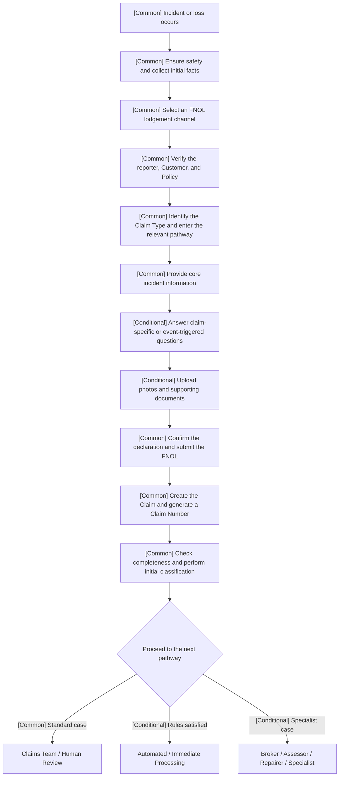
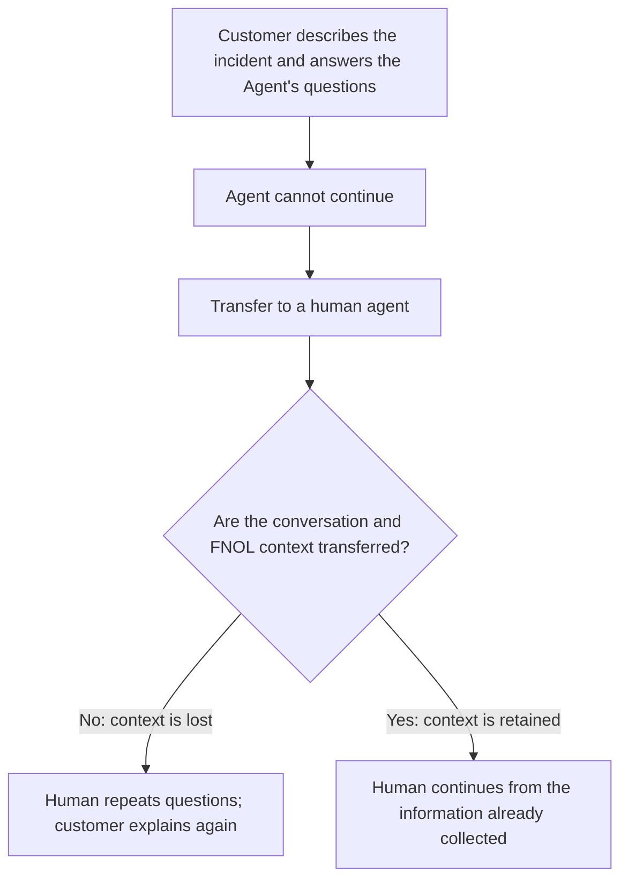

# Concise Research Report on the As-Is FNOL Process and Reporting Fields

## 1. Purpose and Scope

Based on the publicly available claim lodgement processes of State, Tower, NZI, and Westpac Vehicle Insurance, this report identifies a common real-world **First Notice of Loss (FNOL) process** and organises the information fields commonly collected during initial claim reporting.

The report establishes a factual baseline for subsequent **persona development, pain-point research, and solution design**. Its main focus is the current practices of insurers. It also introduces one preliminary competitor weakness relevant to an FNOL Agent: **loss of context during an Agent-to-Human handoff**. This observation is supported by wider industry evidence. However, without direct testing or interview evidence, the report does not claim that State, Tower, NZI, or Westpac necessarily has this weakness, nor does it propose a specific solution.

### Research Method and Evidence Boundary

The report uses publicly available insurer claim pages, forms, guidance, and relevant industry material to compare observable process steps and reporting fields. It distinguishes three levels of statement:

- **source fact:** directly stated or shown in a cited public source;
- **cross-source pattern:** a process element observed across multiple reviewed sources;
- **research hypothesis:** a plausible weakness or design question that still requires direct testing, interview evidence, or organisation-specific confirmation.

The resulting field list is a research taxonomy, not a mandatory universal form. Required information varies by product, incident, policy, jurisdiction, channel, and processing stage. The report does not establish Northwind's internal workflow, data schema, decision authority, or production routing rules.

For this report, the scope of FNOL is defined as:

> **An incident or loss occurs → the customer contacts the insurer for the first time → initial information and evidence are submitted → a Claim is created → the case is initially classified and handed over for further processing.**

Liability determination, detailed investigation, repair, settlement, and closure belong to subsequent Claims Management and are not covered in detail.

---

## 2. Common As-Is FNOL Flow

### 2.1 Unified Process Flow

- **[Common]:** A core step generally found across insurers' FNOL processes.
- **[Conditional]:** A step that appears only for a particular insurer, lodgement channel, Claim Type, or incident circumstance.

### 2.2 Summary of Process Steps

| Stage | Main activity in current practice | Applicability |
|---|---|---|
| 1. Incident occurs | An insured event occurs, such as a vehicle accident, theft, glass damage, storm damage, or property damage | **Common** |
| 2. Safety and on-site information | Ensure personal safety, prevent further loss, and record the time, location, event details, damage, and people involved | The main step is **common**; Police, Towing, and Emergency Service involvement are **conditional** |
| 3. Select a lodgement channel | Begin the claim through an Online Form, App, My Account, Phone, Broker, or nominated Specialist channel | **Common**; the available channel varies by insurer and Claim Type |
| 4. Customer / Policy verification | Confirm the reporter, insured person, contact details, and relevant Policy | **Common** |
| 5. Claim Type routing | Select Vehicle, Property, Contents, Theft, Glass, or another category and enter the corresponding form or process | **Common** |
| 6. Submit core information | Provide What, When, Where, preliminary Cause, and a Damage/Loss Summary | **Common** |
| 7. Conditional information and evidence | Depending on the event, provide Vehicle, Driver, Third Party, Witness, Police, Injury, photo, and document information | **Conditional / Claim-Specific** |
| 8. Confirm and submit | Confirm the information, Privacy/Consent terms, or truthfulness declaration and formally submit the FNOL | **Common** |
| 9. Claim creation | The system or an employee receives the FNOL and creates a Claim Record, Claim Number, and initial status | **Common** |
| 10. Initial checking and routing | Check information completeness and route the case to human review, automated processing, repair, assessment, or specialist handling | Checking and routing are **common**; the destination is **conditional** |

### 2.3 Key Conditional Differences

The four insurers broadly follow the same core process, but the following aspects are not standardised:

- **Different lodgement channels:** Some insurers primarily use an App, My Account, or Online Form, while others rely more heavily on a Broker or Phone channel.
- **Different Claim Types:** Vehicle, Property, Contents, Glass, and Theft claims enter different forms and questioning pathways.
- **Different evidence-submission timing:** Photos and files may be uploaded during FNOL or supplied after the Claim has been created.
- **Different initial handling methods:** Some straightforward cases may enter automated or immediate processing, while others are reviewed by Claims Staff.
- **Different specialist pathways:** Particular cases may be referred directly to a Broker, Assessor, Repairer, Glass Provider, or another Specialist.

### 2.4 Observed Competitor Weakness: Loss of Context During Agent-to-Human Handoff

#### Definition of the weakness

A customer may already have described the incident to a chatbot or AI Agent, answered follow-up questions, and supplied personal or Policy information. The Agent may then transfer the case to a human because of complexity, permission limits, business rules, or an inability to understand the request. If the human agent does not receive the complete conversation, collected fields, attachments, and reason for escalation, the customer must explain the incident and provide the information again.

#### Why this is an important FNOL-stage weakness

The central purpose of FNOL is to collect the initial incident narrative and facts. If context is lost during an Agent-to-Human Handoff, information already collected cannot flow continuously into the Claim Record. This can result in:

- **Repeated effort for the customer:** The customer must provide What, When, Where, Damage, Third Party, and other previously supplied information again.
- **Longer reporting time:** The human agent must reconfirm the facts instead of continuing from the point reached by the Agent.
- **Risk of inconsistent information:** A second account may contain omissions or wording differences because of stress, fatigue, or a change in how the customer explains the event.
- **A disrupted experience:** The customer sees the Agent and human interaction as one claim-reporting journey, while the organisation may treat them as separate contact events.
- **Duplicated work for employees:** Claims Staff must recollect, organise, and enter information that the Agent has already obtained.

#### Supporting evidence

- Salesforce's summary of customer research reports that **56% of customers often have to repeat or re-explain information to different representatives**, indicating that continuity across staff members or departments is a common issue. [Salesforce — What Are Customer Expectations?](https://www.salesforce.com/small-business/what-are-customer-expectations/)
- The Genesys 2026 State of Customer Experience report states that **95% of consumers consider it important for context to be retained when switching channels**. [Genesys — 2026 State of Customer Experience](https://www.genesys.com/resources/state-of-cx)
- Microsoft's Bot Framework guidance for human handoff explicitly identifies **handoff context** and the **conversation transcript** as content that may accompany a transfer event, allowing a human agent to understand the reason for escalation and review the preceding conversation. Conversely, if this content is not transferred, the human agent cannot naturally continue the original interaction. [Microsoft Learn — Transition conversations from bot to human](https://learn.microsoft.com/en-us/azure/bot-service/bot-service-design-pattern-handoff-human?view=azure-bot-service-4.0)
- McKinsey's research on insurance customer experience notes that insurers may view touchpoints such as websites and call centres as separate events, while customers see them as one continuous journey towards the same goal. [McKinsey — Superior customer experience in insurance](https://www.mckinsey.com/industries/financial-services/our-insights/the-growth-engine-superior-customer-experience-in-insurance)

#### Public examples from other companies

The following examples fall into two categories: **cases exposing the limits of automation or a service interruption**, and **practices that incorporate contextual continuity into their design**. They show that the issue is observable in real business environments and establish comparison criteria for later competitor testing. They do not imply that every part of these companies' services either has or has fully resolved the issue.

| Company / industry | Publicly reported facts | Relevance to FNOL Agent-to-Human Handoff | Evidence boundary |
|---|---|---|---|
| **DPD / Logistics** | In 2024, a customer used DPD's AI chatbot to enquire about a missing parcel, but the bot failed to provide effective assistance. After the incident became public, DPD disabled the affected AI component and separately contacted the customer to resolve the parcel issue. | This shows that when an Agent cannot resolve a complex or exceptional event, an automated entry point can become a dead end unless the customer can promptly reach an effective human pathway. For FNOL, testing must cover not only whether the Agent responds, but also how the customer proceeds when it fails. | Public reporting confirms that the bot did not resolve the issue and that staff later intervened, but it does not disclose whether a Transcript was transferred. It therefore cannot be directly described as a context-loss case. [The Guardian — DPD AI chatbot incident](https://www.theguardian.com/technology/2024/jan/20/dpd-ai-chatbot-swears-calls-itself-useless-and-criticises-firm) |
| **Klarna / Fintech** | Klarna previously used an AI Assistant to handle most customer-service conversations. In 2025, it increased investment in human service and emphasised that customers should always be able to choose human support; management acknowledged that an excessive focus on cost had affected service quality. | This shows that a high automation rate or shorter handling time alone does not guarantee a good customer journey. Complex, sensitive, or non-standard cases still require a clear human pathway, particularly in FNOL situations involving emotional pressure and complex facts. | The case supports the need to retain human capability and define appropriate escalation boundaries, but public material does not disclose the context payload of individual AI-to-Human handoffs. [CX Dive — Klarna reinvests in human customer service](https://www.customerexperiencedive.com/news/klarna-reinvests-human-talent-customer-service-AI-chatbot/747586/) |
| **AXA / Insurance** | AXA's chatbot first handles common questions and attempts to gather additional context. If the issue remains unresolved, the customer can use a button to connect with a human Service Agent in the relevant department. | This demonstrates that a reasonable As-Is / Hybrid model in insurance does not require the bot to handle every situation. It should recognise its limits and route the customer to the appropriate human team. | The case confirms the availability of human escalation and departmental routing, but does not specify whether the entire Transcript, extracted fields, or attachments are transferred to the human interface. [INNOQ — AXA Chatbot case study](https://www.innoq.com/en/cases/axa-chatbot-als-unterstuetzung-im-kundenservice/) |
| **AA Ireland / Insurance and roadside services** | AA Ireland's bot is integrated with Zendesk, and a conversation can be transferred to Human Chat when the customer requires further assistance. The case also indicates that the bot was used to reduce missed webchats and allow staff to continue interactions that could not be completed automatically. | This shows that an insurer can place bot and human chat within one service chain instead of requiring the customer to leave the bot, find a phone number, or open another channel. | The public case mainly concerns Quote / Sales and general service rather than FNOL. It is useful as a reference for channel-transfer design but does not prove that claim fields are written into a Claim System. [Insurance Business — AA Ireland bot and human transfer](https://www.insurancebusinessmag.com/us/news/technology/how-chatbots-are-revolutionizing-the-insurance-customers-journey-194615.aspx) |
| **Zurich Insurance Hong Kong / Insurance** | Zurich's Agent first triages the customer's enquiry and collects initial information such as the Policy Number before escalating to a human team. Its Contact Centre integrates WhatsApp, Call, SMS, and Email in one environment, where staff can access the complete conversation history, Policy information, and the customer's previous contact records. | This is the positive example most closely related to FNOL: the Agent collects identity and initial needs, and the human continues using existing information rather than starting again. It indicates that an effective handoff should at least transfer customer identity, Policy, need/intent, conversation history, and completed initial triage. | The case covers the Motor Claim Process and customer service, but does not disclose the full data structure, every Claim field, or how attachments are transferred. It also cannot establish that every Zurich region or product uses the same process. [Microsoft Customer Story — Zurich Insurance Hong Kong](https://www.microsoft.com/en/customers/story/24082-zurich-dynamics-365-contact-center) |
| **KLM / Aviation** | KLM places AI and humans within the same Conversation across Twitter, Messenger, and WhatsApp. Common questions can be answered automatically, while matters requiring human judgement are taken over by a Service Agent. KLM also integrated the capability into its existing Contact Centre Software. | This demonstrates that Human+AI collaboration within one conversation is a model used in practice. In an FNOL setting, transfer to a human does not have to end the Session or force the customer to change channels and restart the claim. | This is not an insurance claim example, and the public material focuses on hybrid conversations rather than the transfer of structured business fields. [KLM — Human+AI conversations](https://news.klm.com/klms-next-step-using-artificial-intelligence-on-social-media/) |
| **Vodafone / Telecommunications** | In its description of SuperTOBi, Vodafone states that Customer Context and History are shared across experiences so customers do not need to repeat themselves. When SuperTOBi or another AI Agent transfers the interaction to a human team, the human can continue from the appropriate point. | This directly supports the report's central finding: the value of a handoff is not merely that a human is reached, but that the human receives enough context to continue from where the Agent stopped. | This is Vodafone's public account of its current design objectives and practices, rather than an independent audit, and it cannot be treated as direct evidence about an insurance-claim environment. [Vodafone — Rebuilding Customer Trust with AI and Human Agents](https://www.linkedin.com/posts/vodafone_asktheexperts-customerconnections-vodafone-activity-7465376975310954496-JoRu) |

Together, these cases form a clearer chain of evidence:

1. **Agents inevitably have capability boundaries.** The experiences of DPD and Klarna show that bots cannot effectively resolve every exceptional, complex, or high-emotion case, and that pursuing automation rates alone can reduce service quality.
2. **The ability to reach a human is only the minimum requirement.** AXA and AA Ireland demonstrate that a human pathway and correct routing can be embedded in a bot process, although public information may not confirm whether the transfer content is complete.
3. **A context-rich human transfer creates a continuous handoff.** Zurich Hong Kong, KLM, and Vodafone demonstrate more complete Hybrid models in which human staff can access earlier information within the same conversation or a unified service environment and continue from the point already reached.

Consequently, later evaluation of FNOL competitors should not merely check whether a page offers **Talk to a human** or displays a phone number. The evaluation should distinguish three levels:

| Handoff level | Observable criterion |
|---|---|
| **Level 1: Human pathway** | When the Agent cannot continue, or when the customer asks, can the customer reach a human channel? |
| **Level 2: Transfer within the same conversation** | Is the original Session retained without requiring the customer to find another entry point or repeat basic identity verification? |
| **Level 3: Complete contextual handoff** | Does the human receive the Transcript, structured FNOL fields, attachments, completed steps, missing items, and reason for escalation, and can they continue from the interruption point? |

Only Level 3 directly demonstrates that the weakness examined in this report has been avoided.

#### Limits of the conclusions about the four insurers

Public information confirms that these insurers provide multiple FNOL or follow-up channels: State offers its App / My State; Tower provides My Tower, Online, and Phone channels; NZI primarily works through Brokers while retaining direct contact channels; and Westpac Vehicle Insurance offers an Online Portal and Emergency Phone service. See [State](https://www.state.co.nz/contact), [Tower](https://www.tower.co.nz/contact-us/), [NZI](https://www.nzi.co.nz/claims), and [Westpac](https://www.westpac.co.nz/insurance/car-vehicle/make-a-claim-on-car-vehicle-insurance/).

However, these public pages do not explain:

- whether a complete Transcript accompanies an Agent-to-Human transfer;
- whether collected FNOL fields enter the human workspace in a structured format;
- whether photos and files are transferred together under the same Session / Claim ID; or
- whether the human agent can see the reason for escalation, the steps already completed by the Agent, and the information that is still missing.

This report therefore defines the current finding as follows:

> **Industry evidence establishes context loss as a common service-continuity weakness. Whether it exists in State, Tower, NZI, Westpac, or another specific competitor must be verified through direct channel testing, customer interviews, or employee interviews.**

#### Questions for subsequent validation

The following questions can be used in competitor testing, surveys, or interviews:

1. After transfer, does the staff member know what the customer has just told the Agent?
2. Can the human agent see the Policy, Incident, Date/Time, Location, Damage, and Evidence already collected by the Agent?
3. What information must the customer repeat, and how many times?
4. After transfer from the Agent, does the interaction continue in the same conversation, or must the customer call again, repeat identity verification, or start a new claim?
5. Are the Transcript, structured fields, attachments, and reason for escalation linked to the same Session ID or Claim ID?
6. Does the human agent know why the Agent could not continue and where the process should resume?

---

## 3. Common FNOL Fields

### 3.1 Field Categories

| Category | Meaning |
|---|---|
| **Core FNOL** | Information generally required for most Claims during initial reporting |
| **Conditional** | Information triggered by the circumstances, such as the involvement of a Third Party, Witness, Police, or Injury |
| **Claim-Specific** | Information determined by the insurance product or Claim Type, such as Vehicle-, Property-, or Contents-specific fields |
| **System-Generated** | Information created by the insurer's system or staff after receiving the report |
| **Later-Stage** | Information usually supplied after FNOL during investigation, assessment, or settlement |

### 3.2 Common Field List

| Information category | Common field examples | Field type |
|---|---|---|
| **Reporter / Customer** | Reporter's name, Policyholder, relationship to the insured, Phone, Email, Preferred Contact Method | **Core FNOL** |
| **Policy** | Policy Number, insurance product, Policyholder information, or alternative identification where the number is unavailable | **Core FNOL** |
| **Incident** | Incident Type, What Happened, preliminary Cause, Sequence of Events | **Core FNOL** |
| **Date / Time** | Date of Loss, Time of Loss, Date Discovered, Date Reported | Date of Loss is **Core**; Date Discovered is **Conditional** |
| **Location** | Incident Address, Road/Intersection, Property Address | **Core FNOL**; format varies by Claim Type |
| **Damage / Loss** | Item or property damaged, lost, or stolen; preliminary extent of damage; whether it remains usable | **Core FNOL** |
| **Safety / Mitigation** | Injury Risk, Emergency Assistance, Towing, temporary repair, and measures taken to prevent further loss | **Conditional** |
| **Evidence** | Photos, Video, Receipt, Invoice, Police Document, Quote/Estimate | **Conditional**; may be added after FNOL |
| **Vehicle** | Registration, Year, Make, Model, Vehicle Use, whether it is driveable, Towing Location | **Vehicle-Specific** |
| **Driver** | Driver Name, contact details, relationship to the insured, Permission, Licence Details | **Vehicle-Specific** |
| **Third Party** | Name, Contact, Vehicle Registration, Insurer, and details of affected property or people | **Conditional / Vehicle-Specific** |
| **Witness** | Whether witnesses exist, Name, Phone, Email | **Conditional** |
| **Police / Authorities** | Whether the incident was reported, Police File Number, Station/Officer, Emergency Response | **Conditional** |
| **Injury** | Whether anyone was injured, number of people, identity of injured persons, and whether Emergency Services were contacted | **Conditional** |
| **Road / Weather** | Road Condition, Weather, Lighting, Direction of Travel | **Vehicle-Specific** |
| **Property / House** | Property Address, affected areas, habitability, Emergency Repair, Occupancy | **Property-Specific** |
| **Contents / Item** | Item Description, Brand/Model, Serial Number, purchase date, preliminary value, Ownership Evidence | **Contents-Specific** |
| **Theft / Burglary** | Date Discovered, Missing Items, Entry Method, Alarm, Police Reference | **Event-Specific** |
| **Declaration / Consent** | Confirmation of accuracy, Privacy/Consent, representative or Broker relationship | **Core / Conditional** |
| **Claim Administration** | Received Time, Lodgement Channel, Claim Number, Initial Status, Assigned Team | **System-Generated** |
| **Assessment / Settlement** | Complete Repair Report, final Quote, Liability Decision, Bank Account, Settlement Method | **Later-Stage; not part of the common core FNOL fields** |

> This table represents the set of information that may appear in a real FNOL process. It does not mean that every customer must provide every field at once. The actual questions depend on the Claim Type, incident circumstances, lodgement channel, and initial routing rules.

### 3.3 Mapping Fields to Process Steps

| Process step | Main field groups |
|---|---|
| On-site information collection | Incident, Date/Time, Location, Damage, Third Party, Witness, Police, Evidence |
| Customer / Policy verification | Reporter, Customer, Policy, Contact Details |
| Claim Type routing | Incident Type, Insurance Product, Vehicle/Property/Contents information |
| Core information entry | Incident Description, Date/Time, Location, Damage/Loss |
| Conditional questions | Vehicle, Driver, Third Party, Witness, Police, Injury, Road/Weather, Theft |
| Evidence submission | Photos, Video, Documents, Receipts, Police Reference, Quotes |
| Claim creation and routing | Claim Number, Received Time, Channel, Initial Status, Assigned Path |

---

## 4. Role in Subsequent Research

This report provides two common baselines for the next stage: an observable real-world FNOL process and a field framework for use in surveys, interviews, and documentary analysis.

The baseline should be used to test completeness and continuity, not to reproduce every field at the first interaction. Information may be confirmed, proposed, disputed, missing, or expected later, and its relevance depends on the next safe action rather than on completing an exhaustive form immediately.

### Persona Development

Personas can be developed according to participant role, incident circumstances, channel used, principal tasks, information available at the time, and the party receiving the subsequent handoff. Relevant distinctions may include Customer, Driver, Representative, Broker, and Claims Staff, as well as urgent on-site reporting and later reporting after the incident.

### Pain-Point Research

At each process step, subsequent research can examine what task the user must complete, which fields must be supplied, where that information comes from, through which channel it is submitted, what conditions trigger additional questions, and what output follows submission. For Agent-to-Human Handoff, research should specifically verify whether the Transcript, structured fields, attachments, identity-verification results, and reason for escalation move with the conversation, and whether the customer must repeat their account. Pain points should be supported by competitor testing, surveys, interviews, public reviews, or process evidence rather than inferred solely from the number of fields.

### Solution Evaluation

After the pain points have been validated, this report can be used to assess whether a future solution covers the essential process steps, distinguishes Core, Conditional, and Claim-Specific information, supports real-world channel differences, and produces the outputs required for Claim creation and initial routing. It can also assess whether FNOL context remains continuous when an Agent transfers the case to a human. At a minimum, continuity should be tested by confirming whether the Transcript, structured fields, attachments, reason for escalation, and Session / Claim identifiers reach the human agent intact.

---

## 5. Summary

The common real-world FNOL process can be summarised as:

> **Incident occurs → safety and information collection → selection of a lodgement channel → Customer and Policy verification → Claim Type routing → submission of core and conditional information → Evidence submission → Claim creation → completeness check and initial routing.**

Customer, Policy, Incident, Date/Time, Location, and Damage/Loss form the common core. Vehicle, Driver, Third Party, Witness, Police, Injury, Property, Contents, Theft, and Evidence appear according to the Claim Type and incident circumstances.

This report therefore provides a real-world business baseline for later persona development, pain-point validation, and solution comparison. The possibility that **a human agent may not receive the previous context after an Agent transfer, forcing the customer to repeat their explanation**, has been identified as a priority competitor-weakness hypothesis for validation. It should not be attributed to any individual insurer until direct competitor testing or interview evidence is available.
