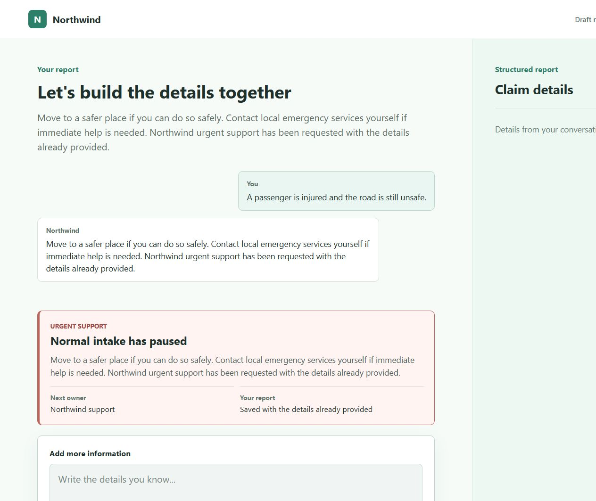

# Day 4 Integration and Journey Verification

## Scope

This record covers the Day 4 checks assigned to `bdfa123` on 13 August 2026.
All inputs are synthetic. The verified base was `main` at `15c870a`; the
candidate integration also included PR #80 (`c8e9a20`) and PR #81 (`9659aa4`).

## Test records

| Check | Input | Response | State change | Result | Defect or limitation |
|---|---|---|---|---|---|
| Repeatable fixtures | Run `python scripts/run_scenarios.py` from the repository root | Four `PASS` results for AT-01, AT-06, AT-08, and AT-12 | Each fixture creates one isolated in-memory repository | Pass after fix | Direct execution previously failed with `ModuleNotFoundError`; fixed by making the runner resolve the repository root itself |
| Clear and guided intake | Synthetic motor description followed by field confirmation | The next unconfirmed material field is requested | Confirmed fields remain confirmed and are not asked again | Pass | The dedicated claimant resume-entry UI remains outside this check |
| Complex/review boundary | Synthetic high-impact Agent proposal | Customer receives `professional_review_required` | Proposal is recorded but the high-impact state change is not executed automatically | Pass | Staff-action completion remains dependent on D3-P08 |
| Pending evidence | AT-06 and a synthetic future police report | Claim remains able to continue unrelated intake and reports one pending item | Evidence becomes `pending_generation` without overwriting other claim-state dimensions | Pass | None in the implemented API scope |
| Image completion | Synthetic JPEG upload target and checksum completion | Evidence returns `received` and file status `ready` | Internal extraction state is `proposed`; the claim form remains unchanged | Pass | The claimant evidence-upload UI remains planned |
| Later submission | Pending evidence followed by the upload/completion route | The later item is listed without exposing provenance | Evidence summary updates without restarting the claim | Pass | Uses the mock evidence-storage adapter |
| Cross-session resume | AT-08 ten-day resume package | Summary, unresolved question, pending item, and prior commitment are restored | Confirmed incident and location fields remain intact | Pass | Full transcript and internal note are deliberately excluded |
| Shared claimant/staff state | AT-12 plus candidate workbench detail from PR #80 | Staff reads the shared persisted claim; claimant projection excludes internal signal | Staff-safe and claimant-safe projections are derived from the same claim revision | Pass in candidate integration | Functional staff actions are not yet implemented |
| Urgent and human support | PR #81 injury, continuing-danger, negated-injury, and explicit-human-request cases | Ordinary intake pauses only for a real urgent/support trigger; claimant is told to contact emergency services themselves | One context-preserving handoff record is stored | Pass in candidate integration | PR #81 is not yet merged into `main` |

## Integration result

PR #80 and PR #81 both add routes to `backend/app.py` and models to
`backend/domain/models.py`, so Git reports two content conflicts when the two
candidate branches are combined. The intended resolution is additive: register
both the workbench and handoff routers and retain both sets of model classes.

After applying that resolution in a disposable integration worktree:

| Check | Result |
|---|---|
| Backend tests | 97 passed |
| Backend coverage | 91.35% (90% required) |
| Ruff formatting and lint | Passed |
| Mypy strict type check | Passed |
| Claimant tests | 6 passed |
| Claimant lint and production build | Passed |

The merge conflict still needs to be incorporated by the owner of whichever PR
merges second. No failing behaviour remained after the additive resolution.

## Demonstration evidence

The capture comes from the locally tested PR #80 + PR #81 candidate. It shows
that ordinary intake pauses, the supplied context is saved, Northwind support
becomes the next owner, and the product does not claim that it contacted
emergency services. A verified staff-action screenshot cannot be captured yet
because D3-P08 has not been implemented; the current candidate provides a
staff detail API rather than a functional employee UI.
